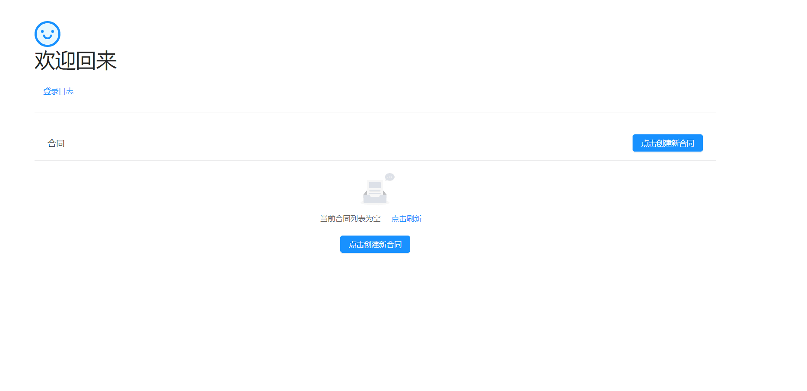

# EContract

## 介绍

EContract是一个基于PKI和二维码实现的身份验证和多点登录的电子合同系统。系统以用户私钥生成签名的不可抵赖性为原理，对签署两方合同的用户双方加以确认，并将被最终确认的合同及生成的凭证保留在服务端以便用户下载或查看。

## 编译与开发环境

开发过程中采用前后端分离的方式。

### 安卓工程的构建

`/android`内保管的是安卓客户端的实现，建议直接以Android Studio打开该工程。

* 编译前，必须设置`ANDROID_HOME`环境变量。
* 编译时，应保证采用了项目配置的Gradle脚本。

### 前端工程的构建

前端分为编辑合同网页和管理员客户端两部分：

* 合同网页

`/webFE`内保管的是合同网页的实现。
合同页面使用vue-cli脚手架完成工程的搭建，并使用vuerouter来承载路由的任务。

* 管理员客户端

`/admin-client`内保管的是管理员客户端的实现。
管理员客户端使用electron提供代码运行的容器，并使用create-react-app构建代码。

### 后端工程的构建和部署

`/server`内保管的是服务端的实现。

* 后端采用SpringBoot框架。
* 将server中的代码copy至新项目，将项目打成jar包。
* 将jar包上传到服务器，然后命令行输入`nohup java –jar (jar包名称) &`，后台就可以启动该项目。

## 用户使用手册

系统只支持安卓移动设备和网页的使用。

用户在持有的安卓设备上进行注册，填报个人信息后可申请唯一账号，并设定口令保护验证用户身份的本地私钥，口令只与该设备绑定。待管理员对用户审批通过后，该用户即可利用此账号进行登录和业务操作。

### 登录功能

系统允许多点登录，根据登录端划分有如下两种：

1. 安卓设备登录

* 完成注册的设备自动拥有对可验证用户身份的私钥（该私钥只对该设备生效，其他人无法盗用），在该设备上用户输入账号和登录口令就可以完成登录。

* 未登录成功过的设备不被允许口令登录，但用户可以利用已登录的设备对新设备进行扫码授权。在新设备中进入扫码登录界面，欲授权的设备在扫描该二维码后，点击确认授权，新设备再设定新登录口令，即可授权，以后新设备的功能权限与原设备无异。

2. 网页登录

* 实际使用需要将系统后台部署于服务器。打开`/login`页面即可获得登录二维码，用已登录的手机扫描该二维码即可实现网页登录。登陆后即跳转到`/home`页面。

### 业务功能

用户的所有业务操作只限于在网页中进行。在登录后，可以指定另一用户创建两方合同、对合同进行上传更新、确认接受或拒绝合同、扫码签署合同、查看登录日志等操作。

### 展示

